## CS-370 Web and Mobile Development Project
## Habib University - Fall 2019 

# Online Medical Store

### Instructions
1. Download Project from repo or this link: https://drive.google.com/open?id=1VRWAjnlPEVcaL1rKtTM8jDccWzyly7IV
2. Install ASP.NET Core Razor Pages 
3. Run si03481_webdev.sln

### Completion of Project Scope
The project does not encompasses online checkout payment and thus does not updates orders table in our Database, as
described in the proposal. It also does not include User Account Registration and Login. Rest of the proposed has been 
completed.

### Statement of Contribution
The project was entirely done by si03481 - Syed Muhammed Abdullah Iqbal

### Sample Run

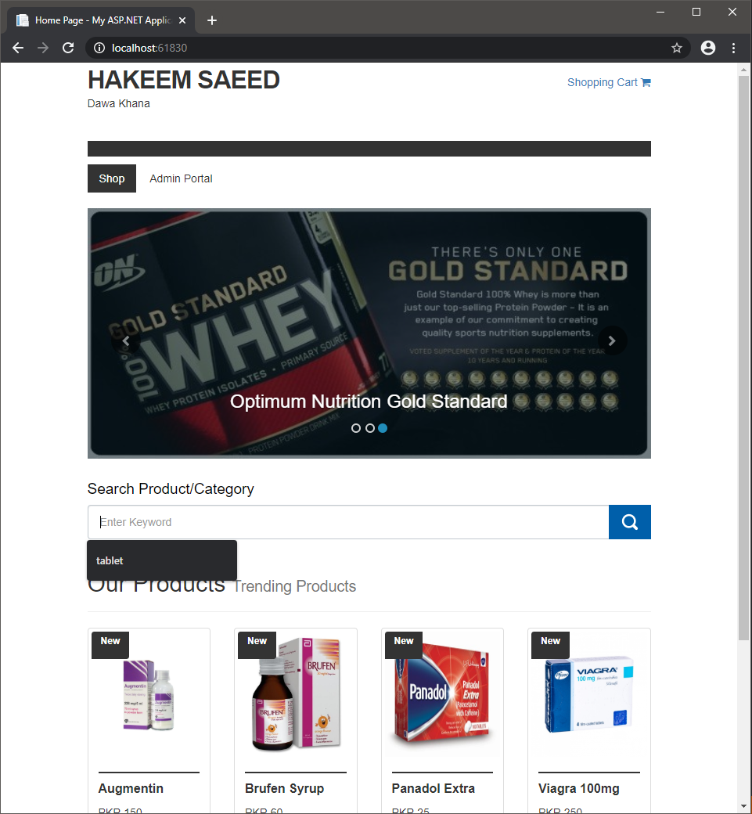

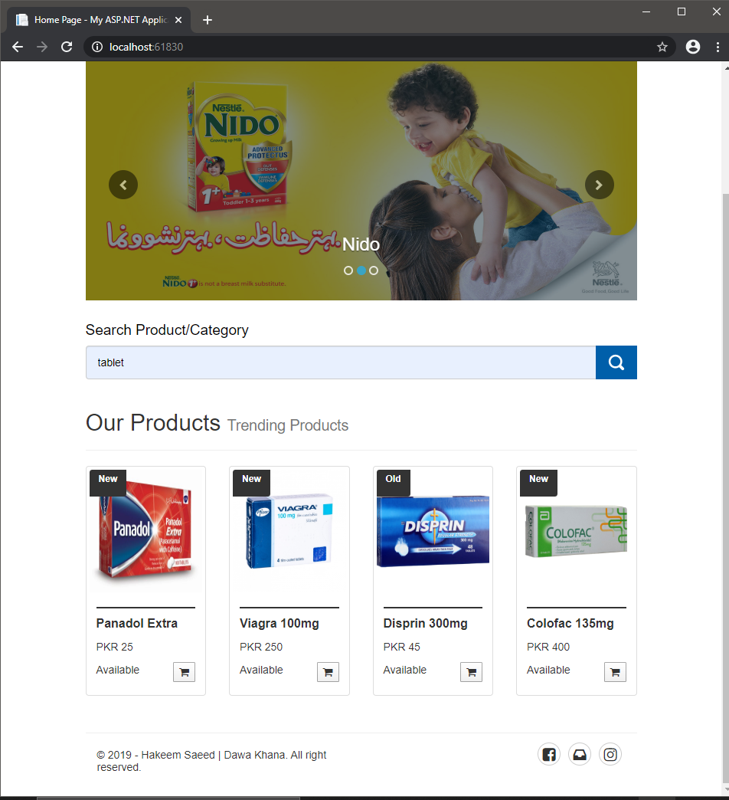

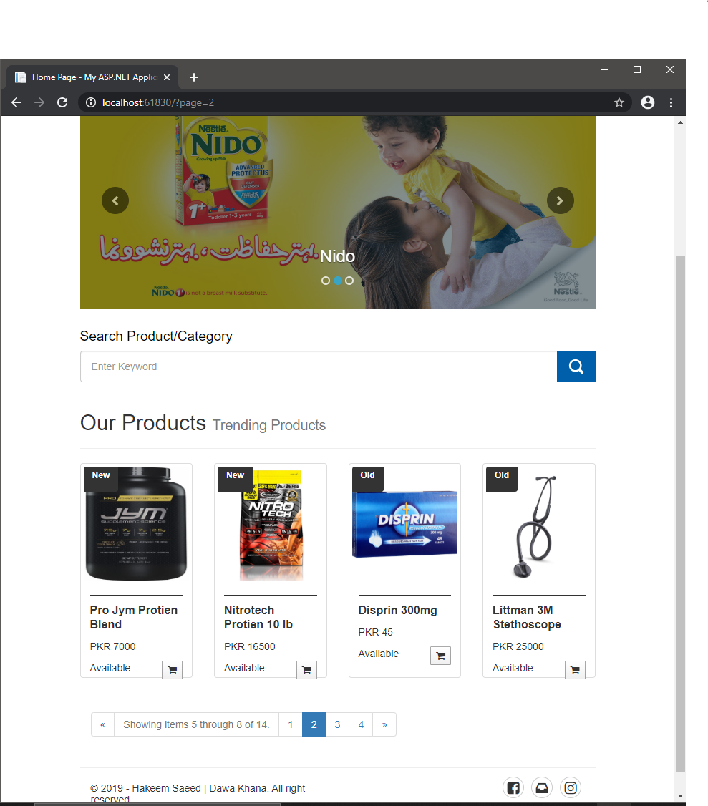

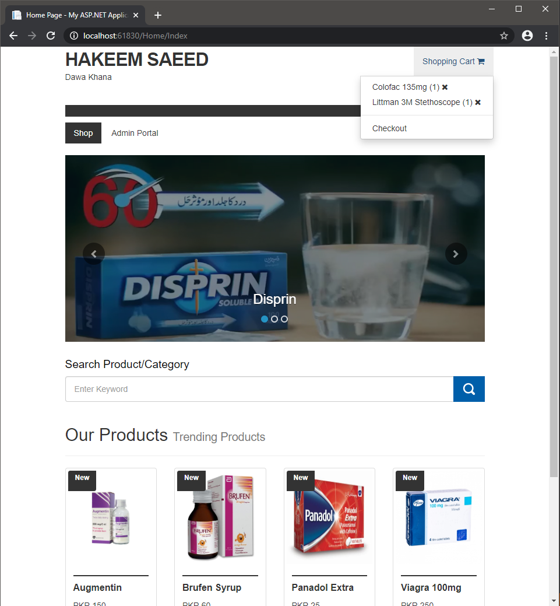

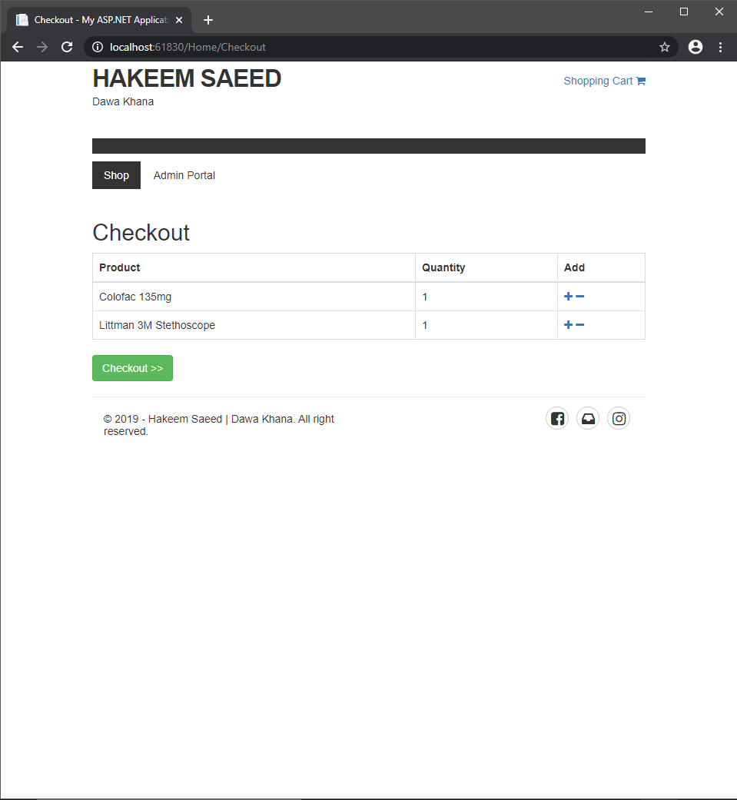

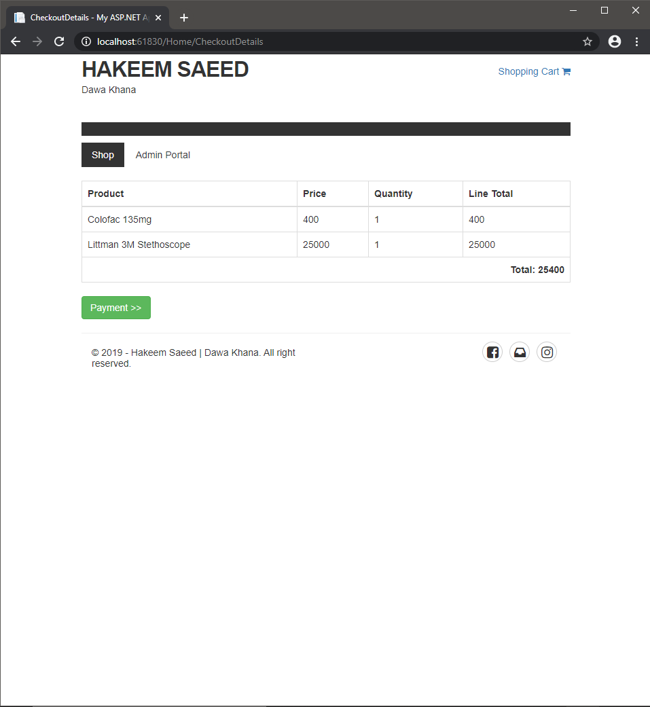

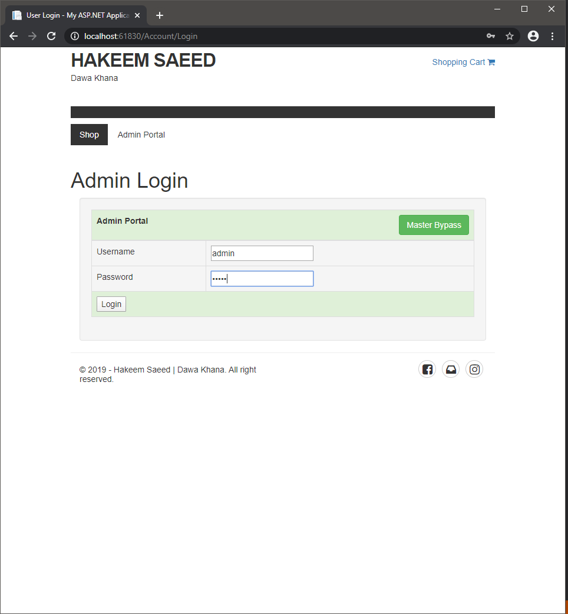

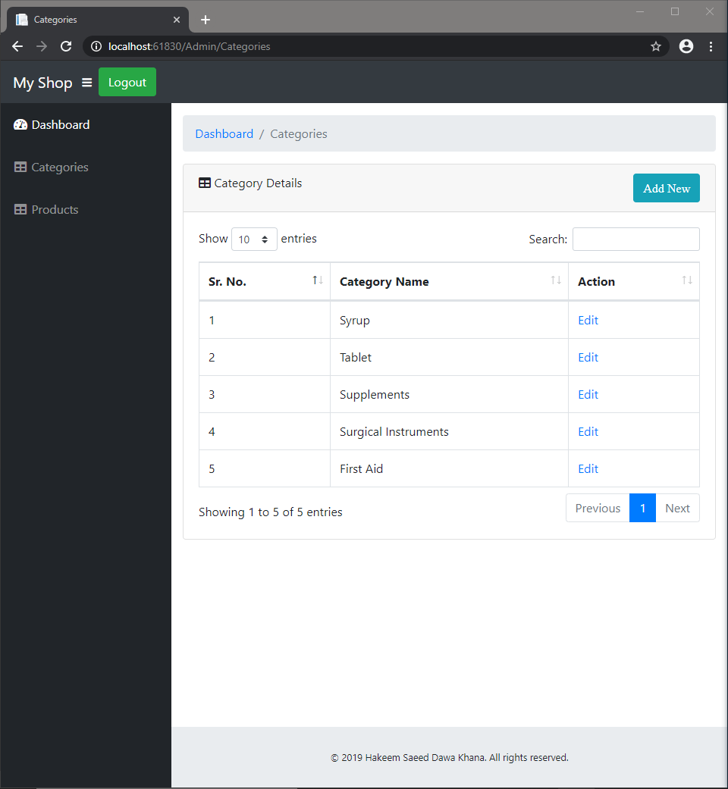

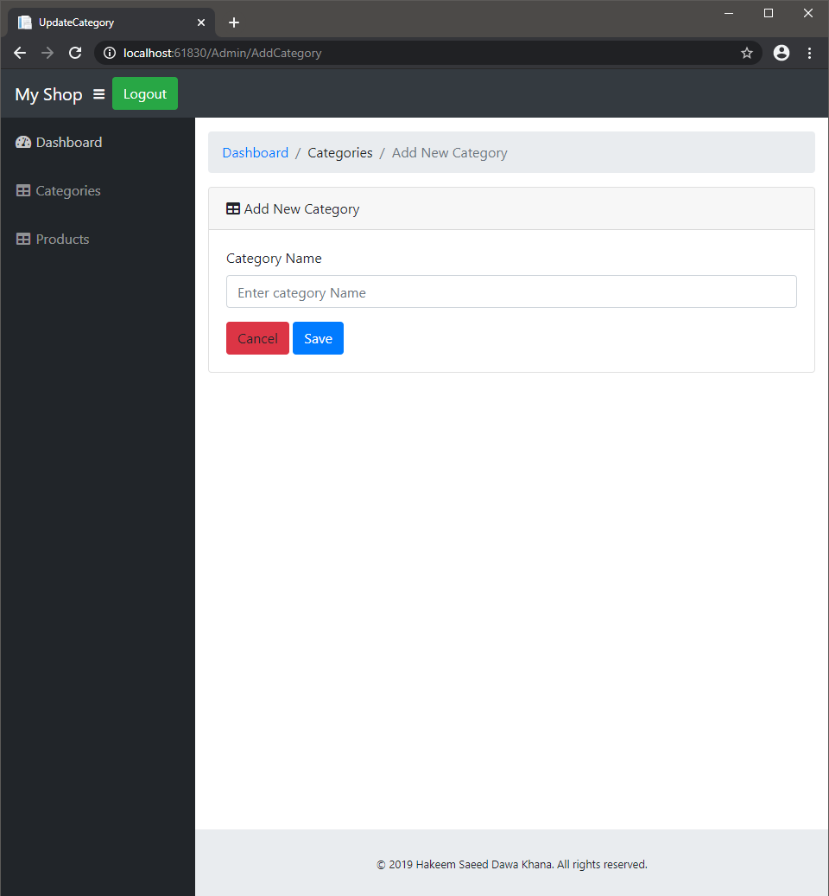

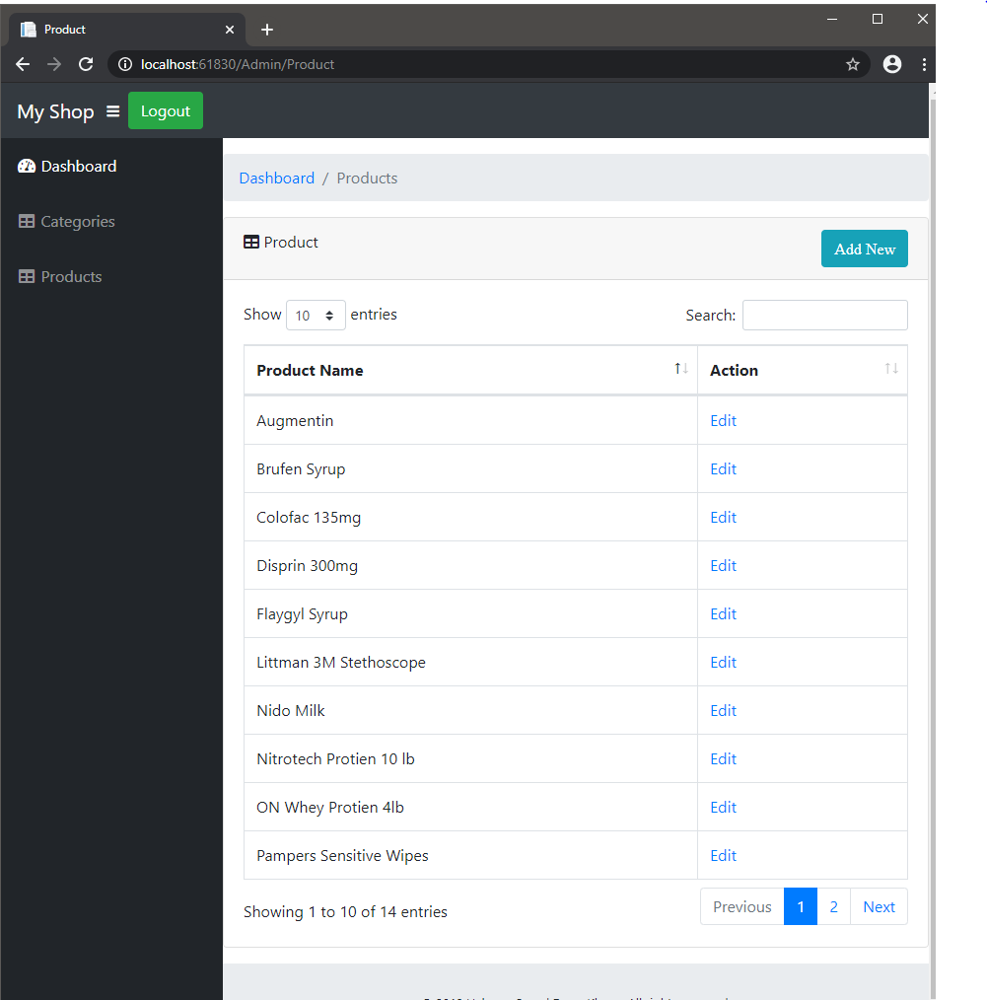

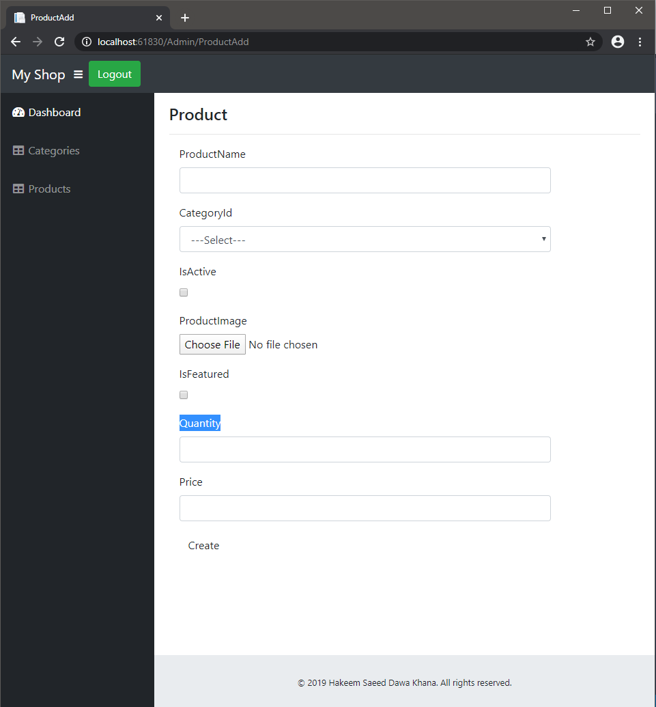
